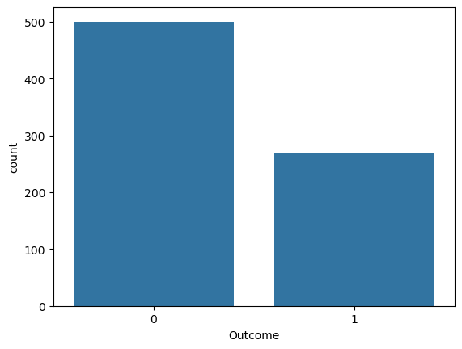
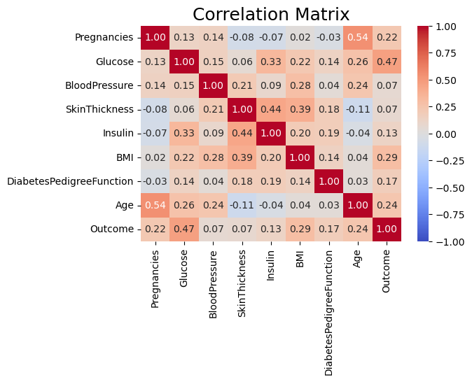
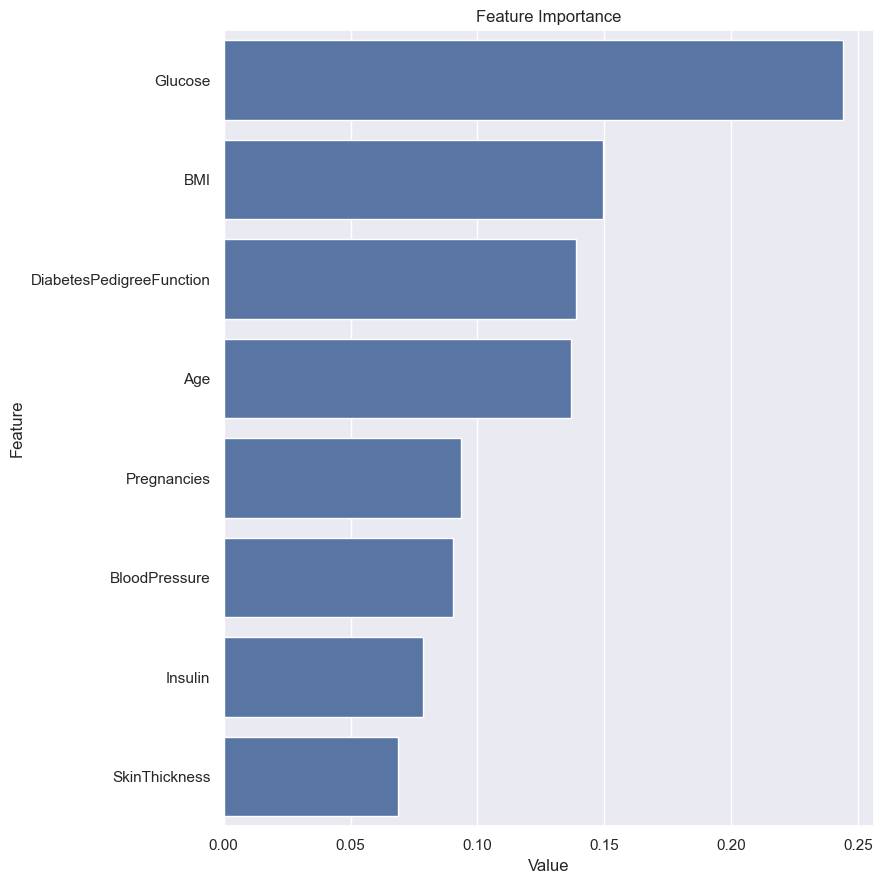
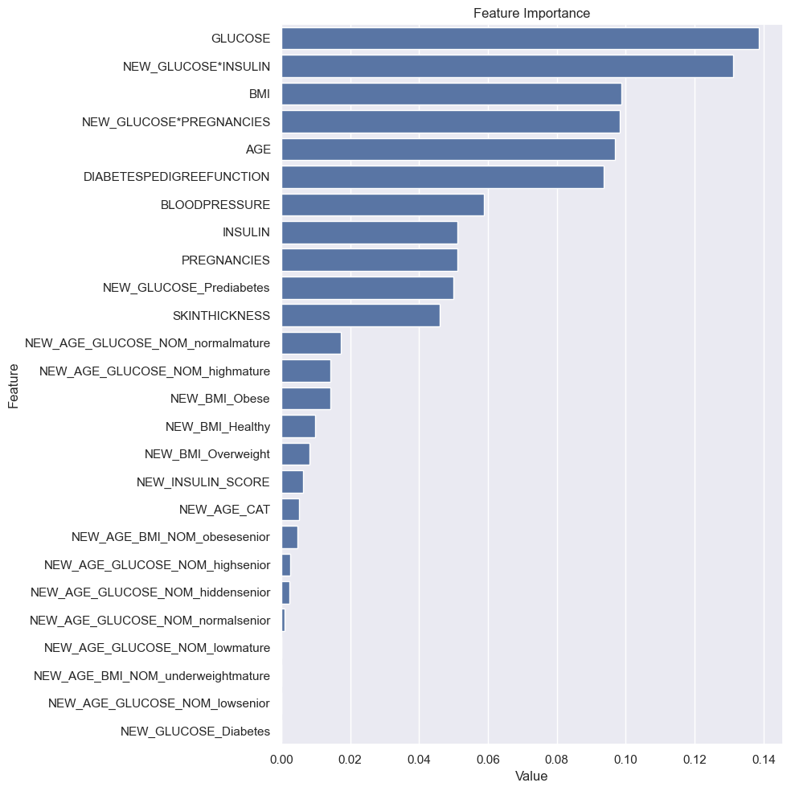

# 🩺 Diabetes Prediction Model with Feature Engineering

## 📖 Business Problem
It is desired to develop a machine learning model that can predict whether people have diabetes when their characteristics are specified. Before developing the model, you are expected to perform the necessary data analysis and feature engineering steps.

**Dataset Story:** The dataset is part of the large dataset held at the National Institutes of Diabetes-Digestive-Kidney Diseases in the USA. Data used for diabetes research on Pima Indian women aged 21 and over living in Phoenix, the 5th largest city of the State of Arizona in the USA.

## 📊 Dataset Features
The dataset consists of 768 observations and 8 numerical independent variables. The target variable is "Outcome".

| Variable | Description |
| :--- | :--- |
| **Pregnancies** | Number of times pregnant |
| **Glucose** | Plasma glucose concentration a 2 hours in an oral glucose tolerance test |
| **BloodPressure** | Diastolic blood pressure (mm Hg) |
| **SkinThickness** | Triceps skin fold thickness (mm) |
| **Insulin** | 2-Hour serum insulin (mu U/ml) |
| **BMI** | Body mass index (weight in kg/(height in m)^2) |
| **DiabetesPedigreeFunction** | Diabetes pedigree function (genetic score) |
| **Age** | Age (years) |
| **Outcome** | Class variable (0 or 1) |

---

## 🛠️ Project Pipeline

### 1. Exploratory Data Analysis (EDA)
* **General Picture:** Examined dimensions, data types, and quantiles.
* **Categorical & Numerical Analysis:** Distribution of variables.
* **Target Analysis:** Analyzed the relationship between the target variable (`Outcome`) and features.

* **Correlation Matrix:** Examined the correlation between features to identify multicollinearity and strong relationships.

### 2. Data Preprocessing
* **Handling "Zero" Values:** In variables like `Glucose`, `Insulin`, `SkinThickness`, `BMI`, and `BloodPressure`, a value of 0 is not biologically possible. These were treated as missing values (NaN) and imputed using the median.
* **Outlier Analysis:** Detected outliers using the IQR method and suppressed them using thresholds.

### 3. Feature Engineering (Key Step)
New features were created to better represent the biological impact of variables:
* **Age Categories:** `mature` (21-50), `senior` (50+).
* **BMI Categories:** `Underweight`, `Healthy`, `Overweight`, `Obese`. 
* **Glucose Categories:** `Normal`, `Prediabetes`, `Diabetes`.
* **Interaction Features:**
    * `NEW_AGE_BMI_NOM`: Combination of Age and BMI classes.
    * `NEW_AGE_GLUCOSE_NOM`: Combination of Age and Glucose classes.
    * `NEW_INSULIN_SCORE`: Categorized Insulin levels (Normal/Abnormal).
    * `NEW_GLUCOSE*INSULIN`: Interaction between Glucose and Insulin. 
    * `NEW_GLUCOSE*PREGNANCIES`: Interaction between Glucose and Pregnancies.

### 4. Encoding & Scaling
* **Label Encoding:** Applied to binary columns.
* **One-Hot Encoding:** Applied to categorical variables.
* **Scaling:** `StandardScaler` was used for numerical variables.

### 5. Modeling (Random Forest)
A Random Forest Classifier was used to predict the outcome. 

---

## 📈 Results & Model Performance

The impact of Feature Engineering on model performance is observed as follows:

| Metric | Base Model | Final Model (w/ Feature Engineering) |
| :--- | :---: | :---: |
| **Accuracy** | 0.77 | **0.79** |
| **Recall** | 0.706 | **0.711** |
| **Precision** | 0.59 | **0.67** |
| **F1 Score** | 0.64 | **0.69** |
| **AUC** | 0.75 | **0.77** |

**Base Model Feature Importance**

**Final Model Feature Importance**

> **Conclusion:** Feature engineering and data preprocessing steps successfully increased the model's accuracy and F1 score.

---
